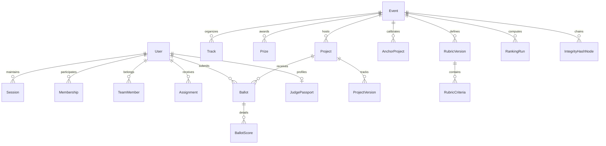

# DOGFOOD OS — Data Model & Schema Specification

## 1. Relational Entities & Invariants



### Critical Invariants

1. **Frozen Submissions**: `isFrozen = true` ensures no future modifications overwrite `frozenHash`. Amendments generate a `ProjectVersion` with incremented `versionNumber` and explicit reason.
2. **Single Team Membership**: A user may belong to at most one team per event.
3. **Ballot Rubric Binding**: Every `Ballot` must foreign-key to an explicit, locked `RubricVersion`.
4. **Append-Only Audit Trail**: `AuditEvent` and `IntegrityHashNode` are write-only from application controllers. Deletion or mutation queries are rejected.

---

## 2. Entity Dictionary

### Core Tables

| Entity | Primary Key | Description | Critical Fields |
|---|---|---|---|
| `User` | `id` (UUID) | System actors across 5 roles | `email`, `passwordHash`, `role` |
| `Session` | `id` (UUID) | Local session tokens | `token`, `userId`, `expiresAt` |
| `JudgePassport`| `id` (UUID) | Private operational records | `completedReviews`, `calibrationBias`, `reliabilityScore` |
| `Event` | `id` (UUID) | Competition instance | `status`, `autopilotMode`, `freezeDeadline`, `disagreeThreshold` |
| `RubricVersion`| `id` (UUID) | Locked evaluation criteria | `version`, `isLocked` |
| `Project` | `id` (UUID) | Submission artifact | `isFrozen`, `frozenHash`, `eligibility`, `techStack` |
| `Ballot` | `id` (UUID) | One judge's score for one project | `status`, `weightedScore`, `ballotHash`, `isFlagged` |
| `RankingRun` | `id` (UUID) | Immutable calculation run | `method`, `parameters`, `runHash`, `isFinalized` |
| `IntegrityHashNode` | `id` (UUID) | Chained SHA-256 blocks | `previousHash`, `currentHash`, `payloadJson`, `timestamp` |

---

## 3. Export Manifest Schema (`/api/v1/trust/events/:id/export`)

```json
{
  "manifest": {
    "schemaVersion": "1.0.0",
    "generatedAt": "2026-09-22T08:00:00.000Z",
    "eventId": "UUID",
    "eventName": "Autonomous Systems & Edge Intelligence 2026",
    "totalProjects": 40,
    "totalAuditEvents": 240,
    "totalHashNodes": 162,
    "chainHeadHash": "SHA256"
  },
  "bundleChecksum": "SHA256_HEX",
  "data": {
    "tracks": [...],
    "prizes": [...],
    "rubrics": [...],
    "projects": [...],
    "ballots": [...],
    "rankingRuns": [...]
  }
}
```
