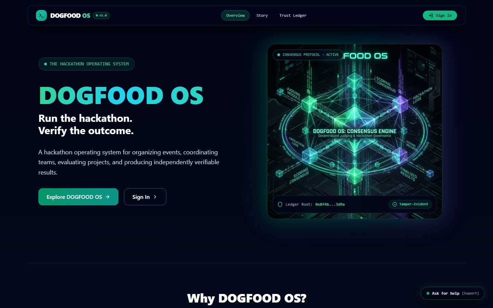
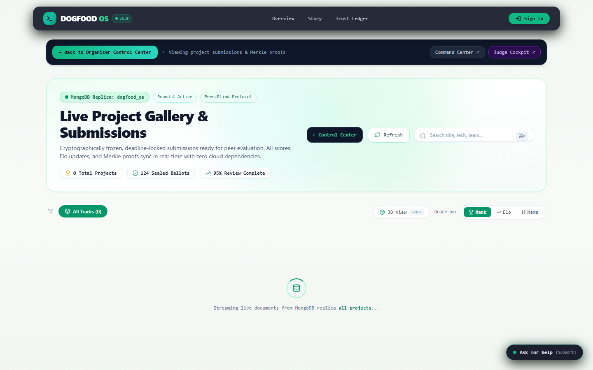

# 🛡️ DOGFOOD OS (Veritas OS)
> **An Agent-Native, Offline-First Operating System for Fair, Auditable, and Peer-Blind Judged Hackathons**

[](https://opensource.org/licenses/MIT)
[](https://nextjs.org/)
[](https://nestjs.com/)
[](https://www.prisma.io/)
[-purple.svg)](https://megallm.io/)

---

## 📖 The Story: Why DOGFOOD OS Exists

Every hackathon suffers from the same three hidden tragedies:

1. **The Disagreement Penalty**: Two judges disagree violently on a breakthrough project (e.g. Judge A gives **4.8/5.0**, Judge B gives **3.0/5.0**). Legacy platforms silently average their scores to a mediocre **3.9**, burying the innovation forever under mathematical noise.
2. **The Cloud Lock-In Trap**: At Hour 44 of a 48-hour sprint, venue Wi-Fi collapses. Locked cloud forms stop loading, API tokens expire, and participants panic as the submission window freezes.
3. **The Black Box Verdict**: Participants receive a final rank with zero transparency into how criteria weights were calculated, whether judges were biased, or if scores were tampered with post-event.

### 💡 The Solution: DOGFOOD OS
**DOGFOOD OS** was engineered to eliminate these flaws. Built on an **offline-first local replica architecture**, **pairwise Elo ranking algorithms**, **natural language prompt synthesis**, **non-mutating rubric weight sandboxes**, and **Merkle tree trust ledgers**, DOGFOOD OS guarantees that every developer’s work is evaluated with zero bias, mathematical transparency, and total resilience.

---

## 📸 Guided Feature Walkthrough & Screenshots

### 1. Overview Landing & System Topology
*The central control hub featuring instant persona switching, real-time event telemetry, and full offline-first resilience.*



#### Key Highlights:
- **Instant Persona Switcher**: Switch seamlessly between **Dr. Elena Rostova** (Organizer), **Dr. Sarah Lin** (Judge), and **Alice Walker** (Participant) in one click without re-authenticating.
- **Offline-First Synchronization**: Runs 100% locally with high-assurance offline persistence. Remote MongoDB sync failures degrade gracefully into self-hosted offline store mode without losing data.
- **Executive Telemetry Cake**: Real-time event statistics including total registered teams, live repository submissions, ballots cast, and review completion rates.

---

### 2. Organizer Command & Telemetry Center
*The mission control panel for hackathon organizers to synthesize, launch, and govern competitive events.*


#### Core Features:
- **Prompt-to-Hackathon ⚡ (AI Fast Mode)**: Describe an event in plain English (e.g., *"Run a 48-hour Solana & Autonomous Agents Hackathon with $60,000 prize pool, 3 tracks, 4 judges per project"*). Powered by MegaLLM (`chatgpt-20b-oss`), the system synthesizes full event parameters, rubrics, tracks, and calibration anchors in seconds.
- **Custom Blueprint Builder 🛠️**: Dynamically define hackathon scale, duration, prize pools, and custom competition tracks with custom color badges. Add or delete tracks dynamically.
- **Targeted Disagreement Routing**: Detects judge score dispersion ($\sigma > 1.5$). Instead of averaging disagreement, DOGFOOD OS automatically routes the project to a 4th neutral judge for targeted resolution.
- **Non-Mutating Weight Sensitivity Simulator**: A live interactive sandbox allowing organizers to adjust rubric criteria weights (Depth, Alignment, Novelty, Evidence) and preview rank movements before locking the official standings.
- **Clean Slate & Seed Demo**: Wipe all mock entries with **`Clear All Entries 🧹`** or seed realistic sandbox data with **`Seed Demo`**.

---

### 3. Participant Mission Control & Idea Potential Coach
*The developer workspace for building, scanning repositories, and submitting projects.*


#### Core Features:
- **Real-Time Pre-Flight Scan**: Scans code repositories for missing dependencies, uncommitted files, broken build scripts, and invalid demo links prior to submission freeze.
- **Idea Potential Coach**: An AI-powered advisory agent that evaluates team hour budgets (e.g. 4 team members = 192 available hours) against scope complexity to prevent over-scoping.
- **Version Snapshotting & Restore**: Save immutable point-in-time snapshots of project drafts and restore previous iterations safely.
- **Deterministic Submission Freeze**: Locks repository commit SHAs and demo URLs at the deadline, generating a cryptographic submission receipt.

---

### 4. Judge Cockpit & Pairwise Elo Engine
*A bias-free evaluation cockpit designed for rigorous, blind peer review.*


#### Core Features:
- **Double-Blind Peer Evaluation**: Obfuscates team names, member avatars, and personal details to eliminate unconscious bias and favoritism.
- **Anchor Calibration Benchmarks**: Before scoring real projects, judges evaluate standardized anchor projects (**Weak**, **Median**, **Strong**) to normalize scoring baselines across different judges.
- **Pairwise Elo Head-to-Head Queue**: Presents judges with side-by-side binary project comparisons (*Project A vs. Project B*) to resolve close leaderboard ties using Elo rating updates.
- **Recusal Guard**: Allows judges to declare conflicts of interest on specific projects with automatic reassignment.

---

### 5. Public Gallery & Transparent Ballots
*A public-facing showcase of hackathon submissions with verifiable score breakdowns.*



#### Core Features:
- **Normalized Rubric Vectors**: Displays exact sub-scores across Technical Depth, Algorithmic Novelty, Working Implementation, and Domain DX.
- **Track Leaderboards**: Filter projects by competitive track, Elo ranking, or submission status.
- **Inspectable Ballots**: Review anonymized judge scorecards and dispersion metrics.

---

### 6. Trust Ledger & Merkle Audit Trail
*The tamper-evident cryptographic verification engine.*


#### Core Features:
- **Cryptographic Receipt Verification**: Computes SHA-256 hashes of every submitted ballot and anchor score, anchoring them into an immutable Merkle tree.
- **Tamper Simulation Sandbox**: Allows auditors to intentionally tamper with a ballot score to verify that the Merkle root immediately flags integrity failure.
- **Exportable Audit Trail**: Download full cryptographic verification proofs and audit trails in JSON/CSV format for external validation.

---

## 🏗️ System Architecture & Data Flow

DOGFOOD OS follows a **Hexagonal / Clean Architecture** pattern designed for high availability and zero cloud lock-in.

```mermaid
graph TD
    User([User / Browser Client]) -->|HTTP / REST| WebApp[Next.js 14 Web Client]
    
    subgraph Frontend Layer
        WebApp --> Navbar[Glassmorphic Navbar & Persona Switcher]
        WebApp --> OrganizerPage[Organizer Control Center]
        WebApp --> ParticipantPage[Participant Mission Control]
        WebApp --> JudgePage[Judge Cockpit]
        WebApp --> TrustPage[Trust Ledger]
    end
    
    subgraph Backend API Layer (NestJS)
        WebApp -->|REST API| NestAPI[NestJS Backend API :4000]
        NestAPI --> AuthGuard[AuthGuard - Fail-Closed / Demo Session]
        NestAPI --> AutopilotCtrl[AutopilotController - MegaLLM]
        NestAPI --> EventsService[EventsService]
        NestAPI --> JudgingService[Judging & Elo Service]
        NestAPI --> TrustService[Trust & Merkle Service]
    end
    
    subgraph Persistence Layer
        EventsService --> PrismaDB[(SQLite / PostgreSQL via Prisma)]
        AutopilotCtrl --> MongoStore[(Local MongoReplica / Offline Store)]
        TrustService --> MerkleEngine[SHA-256 Merkle Audit Tree]
    end
    
    subgraph External Services
        AutopilotCtrl --> MegaLLM[MegaLLM API - chatgpt-20b-oss]
    end
```

---

## 🛠️ Technology Stack

| Layer | Technology | Purpose |
| :--- | :--- | :--- |
| **Frontend** | **Next.js 14 (App Router)** | Server & Client Components, React 18, Tailwind CSS |
| **Styling** | **Vanilla CSS + Glassmorphism** | Custom atmospheric themes, high-contrast dark palette |
| **Icons** | **Lucide React** | Modern iconography suite |
| **Backend** | **NestJS 10** | Enterprise TypeScript framework, Guards, Interceptors |
| **Database** | **Prisma ORM & MongoDB** | Dual-persistence engine with offline fallback |
| **AI / LLM** | **MegaLLM (`chatgpt-20b-oss`)** | Natural language hackathon & rubric synthesis |
| **Algorithms** | **Pairwise Elo & Merkle Trees** | Disagreement routing, tie-breaking, cryptographic trust |

---

## ⚡ Quickstart Guide

### Prerequisites
- **Node.js**: v18.0.0 or higher
- **npm**: v9.0.0 or higher

### 1. Clone the Repository
```bash
git clone https://github.com/ShreyaKaushikdev/veritas-os.git
cd veritas-os
```

### 2. Install Dependencies
```bash
npm install
```

### 3. Environment Configuration
Ensure your `apps/api/.env` file is configured:
```env
PORT=4000
DATABASE_URL="file:./dev.db"
MEGALLM_API_KEY="sk-mega-a2328cb380c9127bf91fc1855d03038e.19194e5d9d2fc9c5723f0a8f9cbbf1b7f8c436bd67e60ea03df872f195c0c7dc"
MEGALLM_MODEL="chatgpt-20b-oss"
FRONTEND_URL="http://localhost:3000"
```

### 4. Run Development Servers
Start both the API backend (`http://localhost:4000`) and Web client (`http://localhost:3000`) in parallel:

```bash
# Terminal 1: Run API Backend
npm run dev:api

# Terminal 2: Run Web Client
npm run dev:web
```

### 5. Access Application
Open your browser and navigate to:
- **Web App**: [http://localhost:3000](http://localhost:3000)
- **Organizer Control Center**: [http://localhost:3000/organizer](http://localhost:3000/organizer)
- **API Swagger Documentation**: [http://localhost:4000/api/docs](http://localhost:4000/api/docs)

---

## 🔑 Demo Account Personas

For instant offline testing, use any of the pre-configured demo personas:

| Role | Name | Email | Referral / Code |
| :--- | :--- | :--- | :--- |
| **ORGANIZER** | Dr. Elena Rostova | `organizer@dogfood.local` | `ORGANIZER-2024-VERITAS` |
| **JUDGE** | Judge Dr. Sarah Lin #2 | `sarah.lin@example.com` | `JUDGE-2024-VERITAS` |
| **PARTICIPANT** | Alice Walker | `alice@dogfood.local` | N/A |

---

## 📜 License
Distributed under the **MIT License**. See `LICENSE` for more information.
